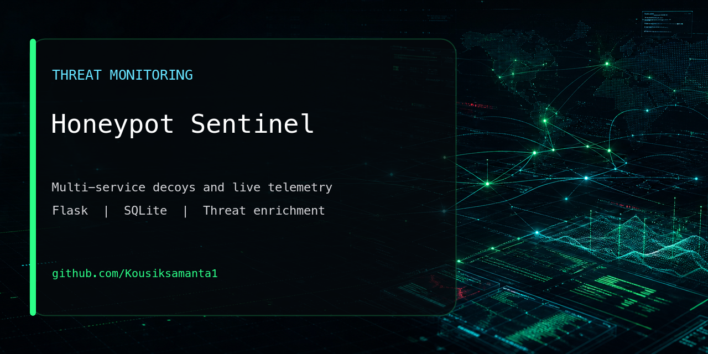

<p align="center">
  
</p>

# Honeypot Sentinel

[](https://github.com/Kousiksamanta1/Honeypot-Sentinel/actions/workflows/ci.yml)
[](https://www.python.org/)
[](https://flask.palletsprojects.com/)
[](#license)
[](https://kousiksamanta1.github.io/PORTFOLIO/)

Honeypot Sentinel is a small, cross-platform network honeypot with a live web
dashboard. It runs decoy SSH, HTTP, FTP, and Telnet services, records what
clients send, enriches public IP addresses with location and reputation data,
and builds a profile for each source.

The project is intended for security labs, learning, and monitoring systems
you own or are explicitly authorized to operate. It is not a replacement for a
production IDS, firewall, or endpoint security product.

## What It Captures

- Source IP address, timestamp, service, and destination port
- Usernames and passwords submitted to the decoy services
- HTTP methods, paths, headers, and POST bodies
- FTP commands, Telnet credentials, and raw SSH client input
- Country, region, city, timezone, coordinates, ISP, and organisation
- AbuseIPDB confidence score when an API key is configured
- First seen, last seen, total attempts, and services targeted per attacker

## Dashboard

The dashboard contains six sections:

| Section | What it shows |
| --- | --- |
| Overview | Totals, service distribution, hourly activity, countries, and common credentials |
| Live Feed | The latest captured events with threat-level highlighting |
| Attack Map | Geolocated public IP addresses on an interactive Leaflet map |
| Locations | Country, region, timezone, and city breakdowns |
| Attacker Profiles | Aggregated history for the most active source addresses |
| Alerts | Sources that exceed the attempt threshold or have a high abuse score |

The main dashboard refreshes every 10 seconds. Map and location data refresh
every 30 seconds.

## Architecture

```text
                           Honeypot Sentinel

  Network clients
        |
        +----------+----------+----------+----------+
        |          |          |          |          |
        v          v          v          v          |
   SSH :2222  HTTP :8080  FTP :2121  Telnet :2323  |
        |          |          |          |          |
        +----------+----------+----------+----------+
                              |
                              v
                   +---------------------+
                   | Honeypot event logger|
                   +----------+----------+
                              |
                   +----------+-----------+
                   |                      |
                   v                      v
          Rotating text log       SQLite events table
                                          |
                                          v
                              Async enrichment queue
                                 /             \
                                v               v
                         ip-api.com       AbuseIPDB v2
                                \               /
                                 v             v
                              Profile aggregation
                                      |
                                      v
                          SQLite attacker_profiles
                                      |
                                      v
                             Flask JSON API
                                      |
                                      v
                       Browser dashboard and maps
```

### Main Components

```text
main.py                  Starts listeners, Flask, and graceful shutdown
config.py                Loads ports, bind addresses, paths, and API settings

honeypot/
  ssh_listener.py        Fake OpenSSH service
  http_listener.py       Fake Apache administrator login
  ftp_listener.py        Fake FTP authentication
  telnet_listener.py     Fake Ubuntu login prompt
  logger.py              Database writes, log rotation, enrichment queue

database/
  models.py              SQLite schema, queries, statistics, and profiles

enrichment/
  geoip.py               Cached and rate-limited ip-api.com lookups
  abuseipdb.py           Optional cached AbuseIPDB checks
  profiler.py            Attacker profile and alert-threshold updates

api/
  routes.py              Dashboard and JSON endpoints

dashboard/
  templates/index.html   Single-page dashboard
  static/                CSS, charts, maps, and browser-side rendering
```

## Event Workflow

1. A client connects to one of the four decoy ports.
2. The listener sends a believable banner or login prompt.
3. Input from the client is captured and immediately written to SQLite and the
   rotating text log.
4. A background worker checks the source IP without blocking the listener.
5. Public addresses are enriched with GeoIP data. AbuseIPDB is queried only
   when a key is configured.
6. The attacker profile is created or updated.
7. The source is flagged when its abuse score is above 50 or its total attempts
   exceed the configured threshold.
8. Flask API endpoints read the stored data and the browser refreshes the
   dashboard.

Private and loopback addresses cannot be geolocated by the public GeoIP
service. Local tests will appear in the feed, but they will not create map
markers.

## Requirements

- Python 3.9 or newer
- `pip`
- Internet access for CDN assets and IP enrichment
- Permission to run the honeypot on the selected machine and network

Download or clone the repository before continuing. All commands below assume
the terminal is open in the project root, where `main.py` and
`requirements.txt` are located.

Check your Python version:

```bash
python3 --version
```

On Windows:

```powershell
py --version
```

## macOS Setup

### 1. Install Python

Python can be installed from [python.org](https://www.python.org/downloads/)
or Homebrew:

```bash
brew install python
```

### 2. Open the project

```bash
cd /path/to/Honeypot-Sentinel
```

For this workspace, the path is:

```bash
cd /Users/kousiksamanta/Documents/Honey-Sentinel
```

### 3. Create and activate a virtual environment

```bash
python3 -m venv .venv
source .venv/bin/activate
```

### 4. Install dependencies

```bash
python -m pip install --upgrade pip
python -m pip install -r requirements.txt
```

### 5. Create the local environment file

```bash
cp -n .env.example .env
```

The AbuseIPDB key is optional. Edit `.env` only if you have one.

### 6. Start the application

```bash
python main.py
```

Open:

```text
http://127.0.0.1:5000
```

macOS may already use port `5000` for AirPlay Receiver. In that case:

```bash
FLASK_PORT=55000 python main.py
```

Then open:

```text
http://127.0.0.1:55000
```

Stop the application with `Ctrl+C`.

## Linux Setup

The commands below use Ubuntu or Debian. Package names may differ on Fedora,
Arch, or other distributions.

### 1. Install Python tools

```bash
sudo apt update
sudo apt install -y python3 python3-venv python3-pip
```

### 2. Enter the project directory

```bash
cd /path/to/Honeypot-Sentinel
```

### 3. Create the environment and install dependencies

```bash
python3 -m venv .venv
source .venv/bin/activate
python -m pip install --upgrade pip
python -m pip install -r requirements.txt
```

### 4. Create `.env` and start

```bash
cp -n .env.example .env
python main.py
```

Open `http://127.0.0.1:5000` on the same machine.

If the server has no desktop, keep the dashboard bound to `127.0.0.1` and use
an SSH tunnel:

```bash
ssh -N -L 5000:127.0.0.1:5000 user@SERVER_IP
```

Open `http://127.0.0.1:5000` on your own computer while the tunnel is running.

## Windows Setup

Install Python from [python.org](https://www.python.org/downloads/windows/).
During installation, select **Add Python to PATH**.

### PowerShell

```powershell
cd C:\path\to\Honeypot-Sentinel

py -m venv .venv
Set-ExecutionPolicy -Scope Process -ExecutionPolicy Bypass
.\.venv\Scripts\Activate.ps1

python -m pip install --upgrade pip
python -m pip install -r requirements.txt

Copy-Item .env.example .env
python main.py
```

Open:

```text
http://127.0.0.1:5000
```

If port `5000` is occupied:

```powershell
$env:FLASK_PORT = "55000"
python main.py
```

### Command Prompt

```bat
cd C:\path\to\Honeypot-Sentinel
py -m venv .venv
.venv\Scripts\activate.bat
python -m pip install -r requirements.txt
copy .env.example .env
python main.py
```

Windows Defender Firewall may ask whether Python can accept incoming
connections. Allow it only on the network profile where you intentionally want
to run the decoys.

## Configuration

Configuration is loaded from `.env`. The defaults are:

```dotenv
ABUSEIPDB_API_KEY=
HONEYPOT_HOST=0.0.0.0
FLASK_HOST=127.0.0.1
FLASK_PORT=5000
DASHBOARD_USERNAME=admin
DASHBOARD_PASSWORD=
API_CORS_ORIGINS=
STORE_SENSITIVE_VALUES=false
```

Additional port variables can be added:

```dotenv
SSH_PORT=2222
HTTP_PORT=8080
FTP_PORT=2121
TELNET_PORT=2323
```

| Setting | Default | Description |
| --- | --- | --- |
| `HONEYPOT_HOST` | `0.0.0.0` | Makes the four decoy listeners available on network interfaces |
| `FLASK_HOST` | `127.0.0.1` | Keeps the unauthenticated dashboard local |
| `FLASK_PORT` | `5000` | Dashboard port |
| `DASHBOARD_USERNAME` | `admin` | Basic Auth username when `DASHBOARD_PASSWORD` is set |
| `DASHBOARD_PASSWORD` | empty | Basic Auth password; required when `FLASK_HOST` is not loopback |
| `API_CORS_ORIGINS` | empty | Comma-separated origins allowed to call `/api/*`; empty keeps API same-origin |
| `STORE_SENSITIVE_VALUES` | `false` | Stores captured passwords and raw payloads only when explicitly enabled |
| `MAX_CLIENT_THREADS` | `50` | Maximum concurrent client handler threads per decoy listener |
| `ENRICHMENT_QUEUE_SIZE` | `1000` | Maximum queued GeoIP/reputation enrichment jobs |
| `GEOIP_LOOKUP_URL` | `https://ipapi.co/{ip_address}/json/` | GeoIP endpoint template |
| `SSH_PORT` | `2222` | SSH decoy port |
| `HTTP_PORT` | `8080` | HTTP decoy port |
| `FTP_PORT` | `2121` | FTP decoy port |
| `TELNET_PORT` | `2323` | Telnet decoy port |
| `ABUSEIPDB_API_KEY` | empty | Enables AbuseIPDB reputation lookups |

Leave `ABUSEIPDB_API_KEY` empty when reputation checks are not needed. Do not
put a real key in `.env.example`; store it only in `.env`, which is excluded
by `.gitignore`.

## Local Network Access

The dashboard is intentionally local by default. To view it temporarily from
another device on a trusted private network, set:

```dotenv
FLASK_HOST=0.0.0.0
FLASK_PORT=55000
DASHBOARD_PASSWORD=replace-with-a-long-random-password
```

Restart the application and find the computer's LAN address.

macOS:

```bash
ipconfig getifaddr en0
```

Linux:

```bash
hostname -I
```

Windows:

```powershell
ipconfig
```

Open `http://LAN_IP:55000` on the second device and authenticate with
`DASHBOARD_USERNAME` and `DASHBOARD_PASSWORD`. Both devices must be on a network
that permits device-to-device traffic. Guest, university, hotel, and workplace
Wi-Fi commonly block this with client isolation.

Return `FLASK_HOST` to `127.0.0.1` before any public deployment.

## Public VPS Deployment

Use a dedicated VPS rather than exposing a personal laptop or home network.
The host should contain no personal data or production credentials.

Allow these inbound TCP ports in both the cloud firewall and host firewall:

```text
2222
8080
2121
2323
```

Keep `5000` and `55000` closed publicly.

Example Ubuntu firewall rules:

```bash
sudo ufw allow OpenSSH
sudo ufw allow 2222/tcp
sudo ufw allow 8080/tcp
sudo ufw allow 2121/tcp
sudo ufw allow 2323/tcp
sudo ufw enable
sudo ufw status
```

Use an SSH tunnel for the dashboard:

```bash
ssh -N -L 5000:127.0.0.1:5000 user@VPS_PUBLIC_IP
```

The decoy ports will be visible to internet scanners, while the dashboard
remains available only through the encrypted tunnel. Discovery time and traffic
volume cannot be guaranteed.

## Data and Logs

| Path | Contents |
| --- | --- |
| `database/events.db` | Events and attacker profiles |
| `honeypot-sentinel.log` | Rotating text event log |
| `.env` | Local secrets and runtime configuration |

The log file rotates at 10 MB and keeps five backups. SQLite uses WAL mode to
support concurrent listeners and dashboard requests.

To start with a fresh database, stop the application first and remove:

```bash
rm -f database/events.db database/events.db-shm database/events.db-wal
```

PowerShell:

```powershell
Remove-Item database\events.db* -ErrorAction SilentlyContinue
```

## Troubleshooting

### Dashboard does not open

- Confirm `main.py` is still running.
- Use the exact address printed in the terminal.
- If port `5000` is occupied, set `FLASK_PORT=55000`.
- Do not use `https://`; the development server uses HTTP.

### Another device cannot connect

- Set `FLASK_HOST=0.0.0.0` and restart.
- Confirm both devices are on the same trusted network.
- Allow Python through the operating-system firewall.
- Disable VPNs temporarily.
- Check whether the Wi-Fi uses guest or client isolation.

### The map is empty

- Local addresses such as `127.0.0.1`, `10.x.x.x`, and `192.168.x.x` do not
  have public GeoIP results.
- Wait for asynchronous enrichment after a public event.
- Confirm the browser can reach Leaflet and CARTO CDN resources.

### Abuse scores are always zero

- The project runs without AbuseIPDB.
- Add a valid key to `.env`, then restart.
- Private IP addresses generally have no public AbuseIPDB result.

### A honeypot port is already in use

Change its port in `.env`, for example:

```dotenv
HTTP_PORT=18080
```

## Security Notes

- The dashboard has no authentication. Never expose it directly to the public
  internet.
- Do not run the project on a machine containing sensitive data.
- Place public deployments in an isolated VPS or network segment.
- Keep the operating system patched and restrict administrative SSH access.
- Treat captured credentials and source information as sensitive data.
- Never reuse captured credentials or interact with attacker systems.

## Technology

| Area | Technology |
| --- | --- |
| Runtime | Python |
| Network services | `socket`, `threading` |
| Web API | Flask, Flask-CORS |
| Storage | SQLite |
| Configuration | python-dotenv |
| Enrichment | requests, ip-api.com, AbuseIPDB |
| Maps | Leaflet, CARTO, OpenStreetMap fallback |
| Charts | Chart.js |
| Frontend | HTML, CSS, vanilla JavaScript |

## Contributing

Use synthetic data and isolated lab environments for tests and screenshots.
Read [CONTRIBUTING.md](CONTRIBUTING.md) before proposing changes.

## Security

Do not disclose captured credentials, public IP telemetry, or deployment details
in an issue. Follow [SECURITY.md](SECURITY.md) for private reporting guidance.

## Legal Disclaimer

Run Honeypot Sentinel only on systems and networks you own or have explicit
permission to monitor. Capturing network traffic, credentials, or source
information may be regulated in your jurisdiction. You are responsible for
access controls, notices, retention, privacy, and all other legal obligations.
The authors and contributors accept no liability for misuse or damage.

## License

MIT. See [LICENSE](LICENSE).
